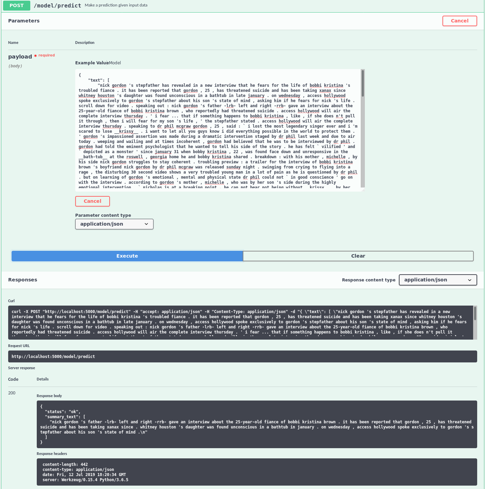

[](https://travis-ci.com/IBM/MAX-Text-Summarizer)
[](http://max-text-summarizer.max.us-south.containers.appdomain.cloud/)

[](http://ibm.biz/max-to-ibm-cloud-tutorial)

# IBM Developer Model Asset Exchange: Text Summarizer

This repository contains code to instantiate and deploy a text summarization model. The model takes a JSON input that encapsulates some text snippets and returns a text summary that represents the key information or message in the input text.
The model was trained on the [CNN / Daily Mail](https://github.com/JafferWilson/Process-Data-of-CNN-DailyMail) dataset.
The model has a vocabulary of approximately 200k words. The model is based on the ACL 2017 paper, [Get To The Point: Summarization with Pointer-Generator Networks](https://arxiv.org/abs/1704.04368).

The model files are hosted on [IBM Cloud Object Storage](https://s3.us-south.cloud-object-storage.appdomain.cloud/max-assets-dev/max-text-summarizer/1.0.0/assets.tar.gz). The code in this repository deploys the model as a web service in a Docker container. This repository was developed as part of the [IBM Developer Model Asset Exchange](https://developer.ibm.com/code/exchanges/models/) and the public API is powered by [IBM Cloud](https://ibm.biz/Bdz2XM).

## Model Metadata
| Domain | Application | Industry  | Framework | Training Data | Input Data Format |
| ------------- | --------  | -------- | --------- | --------- | -------------- |
| NLP | Text Summarization | General | TensorFlow | CNN / Daily Mail | Text |


## References:

* _A. See, P. J. Liu, C. D. Manning_, [Get To The Point: Summarization with Pointer-Generator Networks](https://arxiv.org/abs/1704.04368), ACL, 2017.

* [The text summarization repository](https://github.com/becxer/pointer-generator/)

## Licenses

| Component | License | Link  |
| ------------- | --------  | -------- |
| This Repository | [Apache 2.0](https://www.apache.org/licenses/LICENSE-2.0) | [LICENSE](https://github.com/IBM/MAX-Text-Summarizer/blob/master/LICENSE) |
| Third Party Code | [Apache 2.0](https://www.apache.org/licenses/LICENSE-2.0) | [LICENSE](https://github.com/becxer/pointer-generator/blob/master/LICENSE) |
| Pre-Trained Model Weights | [Apache 2.0](https://www.apache.org/licenses/LICENSE-2.0) | [LICENSE](https://github.com/becxer/pointer-generator/) |
| Training Data | [MIT](https://opensource.org/licenses/MIT) | [LICENSE](https://github.com/abisee/cnn-dailymail/blob/master/LICENSE.md) | [CNN / Daily Mail ](https://github.com/abisee/cnn-dailymail) |

## Pre-requisites:

* `docker`: The [Docker](https://www.docker.com/) command-line interface. Follow the [installation instructions](https://docs.docker.com/install/) for your system.
* The minimum recommended resources for this model is 4GB Memory and 4 CPUs.

# Steps

1. [Deploy from Docker Hub](#deploy-from-docker-hub)
2. [Deploy on Kubernetes](#deploy-on-kubernetes)
3. [Run Locally](#run-locally)

## Deploy from Docker Hub

To run the docker image, which automatically starts the model serving API, run:

```
$ docker run -it -p 5000:5000 codait/max-text-summarizer
```

This will pull a pre-built image from Docker Hub (or use an existing image if already cached locally) and run it.
If you'd rather checkout and build the model locally you can follow the [run locally](#run-locally) steps below.

## Deploy on Kubernetes

You can also deploy the model on Kubernetes using the latest docker image on Docker Hub.

On your Kubernetes cluster, run the following commands:

```
$ kubectl apply -f https://github.com/IBM/MAX-Text-Summarizer/raw/master/max-text-summarizer.yaml
```

The model will be available internally at port `5000`, but can also be accessed externally through the `NodePort`.

A more elaborate tutorial on how to deploy this MAX model to production on [IBM Cloud](https://ibm.biz/Bdz2XM) can be found [here](http://ibm.biz/max-to-ibm-cloud-tutorial).

## Run Locally

1. [Build the Model](#1-build-the-model)
2. [Deploy the Model](#2-deploy-the-model)
3. [Use the Model](#3-use-the-model)
4. [Development](#4-development)
5. [Cleanup](#5-cleanup)


### 1. Build the Model

Clone this repository locally. In a terminal, run the following command:

```
$ git clone https://github.com/IBM/MAX-Text-Summarizer.git
```

Change directory into the repository base folder:

```
$ cd MAX-Text-Summarizer
```

To build the docker image locally, run: 

```
$ docker build -t max-text-summarizer .
```

All required model assets will be downloaded during the build process. _Note_ that currently this docker image is CPU only (we will add support for GPU images later).


### 2. Deploy the Model

To run the docker image, which automatically starts the model serving API, run:

```
$ docker run -it -p 5000:5000 max-text-summarizer
```

### 3. Use the Model

The API server automatically generates an interactive Swagger documentation page. Go to `http://localhost:5000` to load it. From there you can explore the API and also create test requests.

Use the `model/predict` endpoint to load some seed text (you can use one of the test files from the `samples` folder) and get predicted output from the API.



You can also test it on the command line, for example:

```
$ curl -d @samples/sample1.json -H "Content-Type: application/json" -XPOST http://localhost:5000/model/predict
```

You should see a JSON response like that below:

```json
{
  "status": "ok",
  "summary_text": [
      ["nick gordon 's father -lrb- left and right -rrb- gave an interview about the 25-year-old fiance of bobbi kristina brown . it has been reported that gordon , 25 , has threatened suicide and has been taking xanax since . whitney houston 's daughter was found unconscious in a bathtub in january . on wednesday , access hollywood spoke exclusively to gordon 's stepfather about his son 's state of mind . "]
  ]
}
```

### 4. Development

To run the Flask API app in debug mode, edit `config.py` to set `DEBUG = True` under the application settings. You will then need to rebuild the docker image (see [step 1](#1-build-the-model)).

### 5. Cleanup

To stop the Docker container, type `CTRL` + `C` in your terminal.
